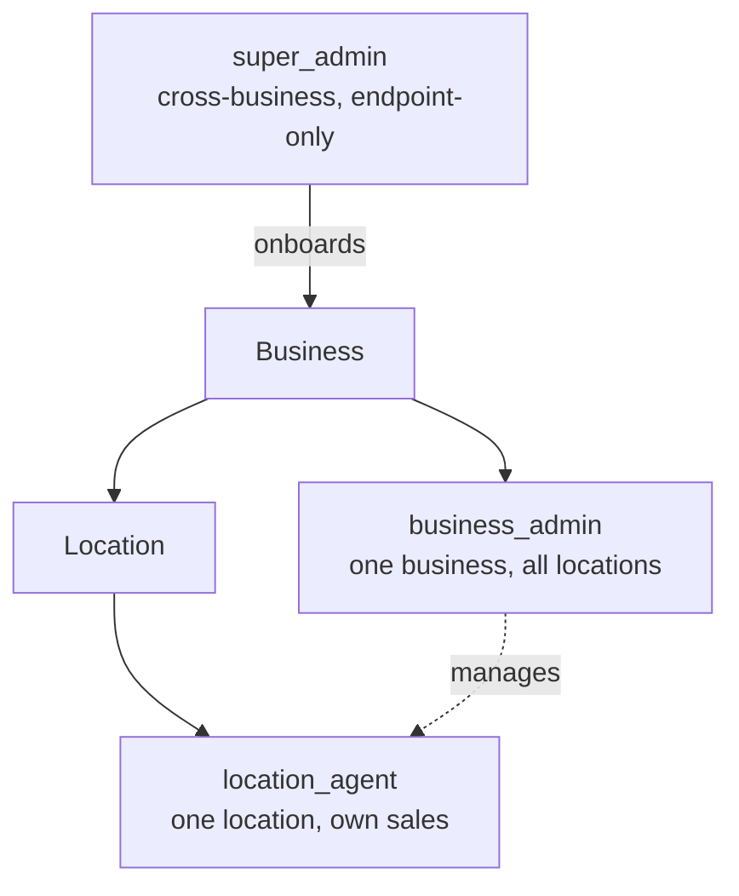
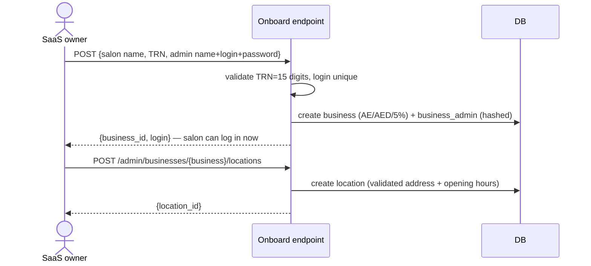
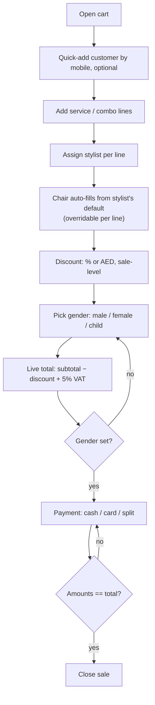
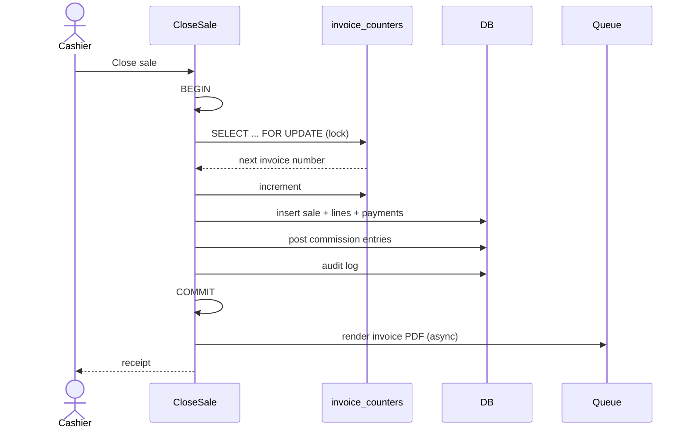
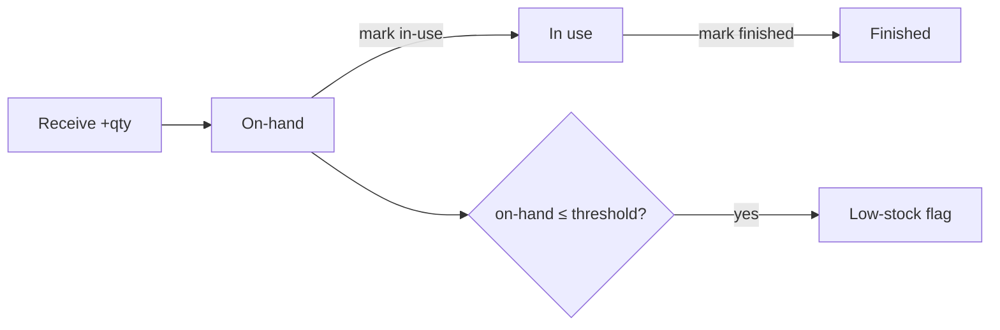
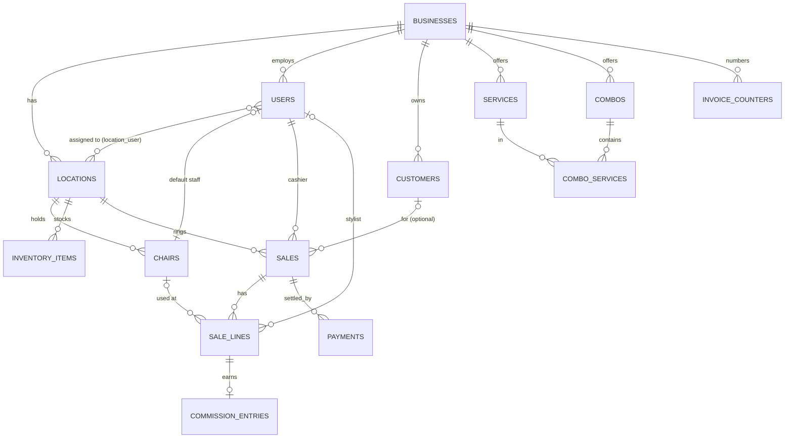
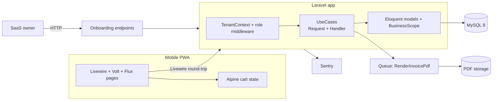

# Saloonify — Product & System Spec

**Status**: source of truth (v1.0 MVP) · last updated 2026-06-14
**Market**: UAE · **Currency**: AED · **Tax**: VAT 5% single-rate

> This is the top-level, human-readable plan. It says **what** Saloonify is, **what the MVP ships**, **how each feature behaves**, and **how the system is shaped**. It is the umbrella over two detailed children:
>
> - `plan.md` — phased build plan + locked technical decisions
> - `tasks.md` — Feature → Issue → PR breakdown with diagrams
>
> If those ever disagree with this doc, **this doc wins** — fix the child.

---

## 1. What Saloonify is

A multi-tenant SaaS that runs the front desk of a UAE salon / beauty parlor from a phone. v1.0 is a **walk-in POS**: ring up services, assign the stylist, take payment, issue a VAT-compliant invoice, send it on WhatsApp, and see the day's sales + stylist commission.

**Who uses it**

| Actor | Who | How they touch it |
| ----- | --- | ----------------- |
| **SaaS owner / Super-admin** | Us (Saloonify staff) | **Endpoint only** — onboards salons + locations on request. No screen in MVP. |
| **Business admin** | Salon owner / manager | Mobile PWA — manages staff + catalog, runs POS, reads reports. |
| **Location agent** | Stylist / cashier | Mobile PWA — runs POS for their assigned location(s). |
| **Walk-in customer** | The salon's customer | Doesn't log in — gets a WhatsApp receipt. |

---

## 2. The MVP bet

**Hypothesis**: a UAE salon will replace its paper/cash-drawer flow with a phone-based POS if it's fast, VAT-correct, and sends a digital receipt — *without* needing appointments, inventory, or a desktop.

**How we validate**: onboard **one real pilot salon**, have its real staff close **5+ real sales unassisted** from their own phones, and confirm the owner trusts the daily report. That's the go/no-go for building further.

**What we deliberately leave out of MVP** (to ship fast): refunds/voids, thermal printing, end-of-day cash close, appointments, native app, Arabic UI, prepaid packages, and *granular* inventory (per-unit consumption auto-deducted on sale). Basic stock tracking **is** in — see §4.8. All exclusions listed in §9 roadmap.

---

## 3. Roles & access (3 fixed roles)



| Role | Scope | MVP surface |
| ---- | ----- | ----------- |
| `super_admin` | all businesses | **Endpoint only** (no UI) |
| `business_admin` | one business, all its locations | Full PWA |
| `location_agent` | assigned location(s), own sales | PWA POS |

No public signup. No custom roles. Isolation enforced in-app: every tenant row carries `business_id` and a global scope filters by the logged-in user's business; `super_admin` bypasses it.

---

## 4. MVP features — what ships and how it behaves

Each feature notes its **surface**: `endpoint` (no UI in MVP) or `mobile UI`.

### 4.1 Salon onboarding — *surface: endpoint only*

The SaaS owner brings a new salon online via endpoints. No screen. Onboarding and location creation are **decoupled** — onboard the business first, then add one or more locations.

- **Onboard business**: `POST` with salon name, TRN (15 digits), and the first admin's name + login + password → creates the **business** + the **business_admin user** (ready to log in immediately). Defaults applied: `country=AE`, `currency=AED`, `tax_rate=5.00`.
- **Add location**: SaaS owner calls the **add-location** endpoint (by business ULID) for each branch. (Self-serve location management by the salon comes post-MVP, gated by subscription tier.)



### 4.2 Staff management — *surface: mobile UI (business_admin)*

Business admin adds staff who then log in and operate POS.

- Create staff: name, **email and/or username** (at least one), password, role (`business_admin`/`location_agent`), and **one or more locations** (a `location_agent` works at the assigned location(s); a `business_admin` spans all). Staff can be moved/added across branches by editing their locations.
- **Emailless staff**: if only a username is given, the system makes a synthetic email (`<username>@<salon-slug>.saloonify.local`) so the account is always valid + unique. Staff log in with **either** email or username.
- Edit / deactivate: `terminated` status blocks login.

### 4.3 Chairs — *surface: mobile UI (business_admin)*

Salons want to know which chair did the work. A **chair** belongs to a location and can have **one default staff** mapped to it.

- Manage chairs per location: name/number, active flag, optional default staff.
- The mapping is a **default, not a lock**: at sale time the chair auto-fills from the assigned stylist's chair, but the cashier can change it. A chair may sit idle or be reassigned.

### 4.4 Services & combos catalog — *surface: mobile UI (business_admin)*

- **Service**: name, price (AED), default commission %, duration (informational). Arabic name slot exists (`translations` JSON) but stays empty in MVP.
- **Combo**: its **own** price (not the sum of parts), a flat combo commission %, an optional default primary stylist, and an ordered list of constituent services. **A combo's makeup is frozen onto the sale at sale time** — later edits to the combo never change past sales.
- Money is stored as **integer fils** (1 AED = 100 fils); AED↔fils conversion happens at the edges only.

### 4.5 Walk-in POS — *surface: mobile UI (any location-scoped user)*

The core. Mobile-first, one-thumb operation.



Rules: each service line carries a **stylist** and a **chair** (chair auto-filled from the stylist's default mapping, overridable). Discount is **sale-level only**. VAT 5% on the discounted net. Customer gender is captured **per sale** (`male`/`female`/`child`), required to close. Payment can split across cash + card; the sum must equal the total.

### 4.6 Sale close, invoice & commission — *surface: endpoint behind the Close button*

Closing a sale is **one database transaction** that must never produce a gap in invoice numbers:



- **Gapless sequential invoice number** per business via row-lock on `invoice_counters`.
- **Commission** auto-posts on close: each service line → its stylist earns the service's % of the (post-discount) line; a combo → its default primary stylist earns the flat combo %. Visible in the report; no payout workflow in MVP.

### 4.7 Receipt + WhatsApp — *surface: mobile UI*

- On close, a **VAT invoice PDF** is rendered (FTA fields: business name, TRN, invoice no, date, line items, subtotal, VAT, total) and stored.
- Receipt screen has one CTA: **Send via WhatsApp** → opens `wa.me/<customer mobile>` pre-filled with a **signed, expiring link** to the PDF. If no customer was captured, it prompts for a number first.
- No thermal printing in MVP.

### 4.8 Inventory (basic) — *surface: mobile UI (business_admin manages; location_agent updates)*

Coarse, manual stock — enough to answer "are we running low on shampoo?". **No per-unit auto-deduction on sale.**

- **Item**: name, optional category, location, **on-hand quantity**, **reorder threshold**.
- **Manual actions**: receive stock (+ qty), mark in-use (move from on-hand to in-use), mark finished. No link to sale lines; no batch/expiry granularity.
- **Low-stock**: when on-hand ≤ reorder threshold, the item flags as low — surfaced in-app (report section + a badge). In-app only, no email/SMS.



### 4.9 Sales report — *surface: mobile UI (business_admin)*

- Date range (default today) + filters (location, stylist, payment method).
- **Sales**: totals (gross / discount / VAT / net), split by payment method, commission accrued per stylist, paginated line detail, and **CSV export**.
- **Chair utilization**: sales/revenue grouped by chair over the range (uses the chair captured per line).
- **Inventory**: current on-hand per item + a **low-stock list** (items at/below reorder threshold).
- All amounts computed in fils — report must match raw SQL to the fils, no rounding drift.

---

## 5. Data model (overview)



**Money**: every amount is `bigint` fils. **Tenancy**: every business-owned table has `business_id`. **Chairs**: `chairs` (location_id, name, active, default_staff_user_id nullable); `sale_lines.chair_id` nullable, auto-filled from the stylist's default. **Inventory**: `inventory_items` (location_id, name, category nullable, on_hand_qty, in_use_qty, reorder_threshold) — manual adjustments only, no sale linkage in MVP. **JSON columns**: location address + hours, business invoice settings, combo snapshot on the sale line, service/combo translations. Full column list lives in `plan.md` §"Core schema".

---

## 6. System shape (architecture)



**Stack** (locked): Laravel 13 · PHP 8.3 · MySQL 8 · Livewire 4 + Volt + Flux + Tailwind 4 + Alpine · plain Breeze auth (no WorkOS) · `moneyphp/money` · `libphonenumber` · dompdf · database queue (Redis/Horizon deferred). Hosting: AWS me-central-1 via Forge (EC2 + RDS). Errors: Sentry.

**Code layout** — vertical-slice: `app/Modules/<Module>/{Http,UseCases,Enums,Models}`, shared bits in `src/Shared/`. Thin page/controller → UseCase (all logic + tests) → model → migration.

---

## 7. Screens & wireframes

Mobile-first, primary viewport ~375 px. One Laravel codebase — every screen below is a Livewire/Volt page; onboarding has **no screen** (endpoint only). Layout pattern: top bar (title + context), scrollable body, **bottom action bar** for the primary CTA (thumb reach). Tap targets ≥ 44 px.

### Screen inventory

| Screen | Route (indicative) | Role | Primary use case |
| ------ | ------------------ | ---- | ---------------- |
| Login | `/login` | all | email-or-username auth |
| POS cart | `/pos` | agent/admin | build sale |
| Item picker (modal) | within `/pos` | agent/admin | add service/combo line |
| Customer quick-add (modal) | within `/pos` | agent/admin | find-or-create customer |
| Payment | `/pos/payment` | agent/admin | CloseSale |
| Receipt | `/sales/{id}/receipt` | agent/admin | view + WhatsApp |
| Sales report | `/reports/sales` | business_admin | ComputeSalesReport |
| Staff list / form | `/staff`, `/staff/create` | business_admin | CreateStaff / UpdateStaff |
| Catalog: services | `/catalog/services` | business_admin | Create/Update Service |
| Catalog: combos | `/catalog/combos` | business_admin | Create/Update Combo |
| Chairs | `/chairs` | business_admin | Create/Update Chair |
| Inventory | `/inventory` | admin (agent updates stock) | item + stock actions |
| _Onboarding_ | `POST /api/admin/...` | super_admin | **endpoint, no screen** |

### POS cart (the core)

```
┌─────────────────────────────┐
│ ← Walk-in sale     Branch ▾  │  top bar: location context
├─────────────────────────────┤
│ 👤 + Add customer (optional) │  tap → quick-add modal
├─────────────────────────────┤
│ Haircut          AED 50  ✎ ✕ │  line: price, edit, remove
│   stylist: Sara ▾  chair: 3 ▾│  stylist→chair auto-fills
│ Beard Trim       AED 30  ✎ ✕ │
│   stylist: Ali ▾   chair: 1 ▾│
│ + Add service / combo        │  tap → item picker modal
├─────────────────────────────┤
│ Discount [ 10 ] (% | AED)    │  sale-level
│ Gender  ( M ) ( F ) ( Child )│  required to checkout
├─────────────────────────────┤
│ Subtotal            AED 80   │
│ Discount          − AED  8   │
│ VAT 5%            + AED 3.60  │  live calc, fils-exact
│ TOTAL               AED 75.60│
├─────────────────────────────┤
│ [   Checkout → Payment    ]  │  bottom bar; disabled if
└─────────────────────────────┘  empty or gender unset
```

### Payment

```
┌─────────────────────────────┐
│ ← Payment        Total 75.60 │
├─────────────────────────────┤
│ Cash   [ 75.60 ]             │
│ Card   [  0.00 ]             │
│  ─────────────────────────   │
│ Paid 75.60   Due 0.00 ✓      │  sum must == total
├─────────────────────────────┤
│ [      Close sale         ]  │  disabled until paid==total
└─────────────────────────────┘
```

### Receipt

```
┌─────────────────────────────┐
│ ✓ Sale closed   INV-000123   │
├─────────────────────────────┤
│ Glow Salon · TRN 100xxxxxxxxx│
│ 15 Jun 2026  ·  AED 75.60    │
│ Haircut  Sara        50.00   │
│ Beard    Ali         30.00   │
│ Discount            − 8.00   │
│ VAT 5%              + 3.60    │
│ TOTAL                75.60   │
├─────────────────────────────┤
│ [ View PDF ]                 │  signed, expiring URL
│ [ Send via WhatsApp ]        │  wa.me deep link
└─────────────────────────────┘
```

### Sales report

```
┌─────────────────────────────┐
│ Sales report                 │
│ [ Today ▾ ] Loc▾ Stylist▾ ◔▾ │  filters
├─────────────────────────────┤
│ Gross 1,200  Disc 80         │
│ VAT 56  Net 1,176            │  totals card
├─────────────────────────────┤
│ By method:  Cash 800 Card 376│
│ By stylist: Sara 12c… Ali …  │  commission accrued
│ By chair:   #1 420  #3 380   │  utilization
│ Inventory:  Shampoo 2 ⚠ low  │  low-stock list
├─────────────────────────────┤
│ Lines …  (paginated)         │
│ [ Export CSV ]               │
└─────────────────────────────┘
```

> List/form screens (staff, catalog, chairs, inventory) share one shell: scrollable card list + "＋ Create" bottom action → single-column form with inline validation and a bottom **Save** bar. Not wireframed individually.

## 8. Build stages

Stage gating keeps the MVP shippable and the pilot honest.

| Stage | Goal | Surface |
| ----- | ---- | ------- |
| **S0 Foundation** | App boots, tenancy + roles + auth proven | — |
| **S1 Salon ready** | A salon exists with admin + location + catalog + staff + chairs + inventory | **Onboarding = endpoint only**; staff + catalog + chairs + inventory = UI |
| **S2 Can sell** | Walk-in sale closes with gapless invoice + commission | POS UI + close endpoint |
| **S3 Can prove it** | Receipt on WhatsApp + daily report + CSV | UI |
| **S4 Pilot** | PWA polish, seed data, real salon UAT | UI |
| **S5 Live** | Production cutover + first real sale | — |

Detailed issue/PR list per stage: `tasks.md`. Maps roughly S0→F0–F2, S1→F3–F6, S2→F7–F9, S3→F10–F11, S4→F12–F13, S5→F14.

---

## 9. Rules that must always hold (acceptance backbone)

- **No cross-business data leak** — ever. Proven by automated tests.
- **Invoice numbers gapless + sequential** per business, even under concurrent closes.
- **All money math in fils**; report totals match raw SQL exactly.
- **VAT 5%** on discounted net; invoice carries FTA-minimum fields + TRN.
- **TRN mandatory** at onboarding (15 digits) — MVP targets VAT-registered salons only.
- **Online-only** — offline shows a banner, preserves the cart, disables close.

---

## 10. Out of scope (MVP) → roadmap

**Not in MVP**: refunds/voids/credit notes, thermal printing, EOD cash close, appointments, native app, Arabic UI, prepaid packages, multi-currency/tax, public signup, self-serve location management, and **granular inventory** (per-unit auto-deduction on sale, batch/expiry tracking, retail item sale lines). Basic manual inventory (§4.8) **is** in MVP.

**Next (v1.1)**: refunds + voids → thermal printing → EOD close → granular inventory (auto-deduct + retail sale + expiry) → Flutter shell.
**Later (v1.2+)**: appointments, push, multi-stylist combo split, Arabic UI, subscription-gated self-serve admin (incl. salons adding their own locations).

---

## 11. Open questions

_None blocking MVP build. Add here if scope questions surface during the build; resolve before the affected feature starts._
