# Saloonify v1.0 — Task Split (detailed)

> Three tiers: **Feature → Issue → PR.**
> - **Feature** (= a GitHub milestone/epic): a capability area.
> - **Issue**: one capability/endpoint. One GitHub issue each.
> - **PR**: a coherent, **tested**, shippable slice of an issue. One PR when small; split at **~500 changed lines** along the backend/surface seam — never a model-only PR. **Tests ship with the use case.**
>
> Authority: `product-spec.md` (conceptual source of truth) → `data-model.md` (physical schema + business-rules registry) → `plan.md` (phased plan + locked tech) → **this file** (issues + PRs). If they disagree, the higher doc wins.

Each issue carries, where relevant: **Goal · PRs · Business rules (BR) · Validation (V) · State machine · Invariants (INV) · Edge cases (E) · Acceptance · Depends · Labels.** Schema columns are NOT repeated here — schema issues reference `data-model.md §<table>`. Every rule has a stable ID in `data-model.md §4` (e.g. `BR-SALE-02`); the BR/V/INV/E lines in each issue are the local, readable view of those IDs — when in doubt, the registry is canonical.

---

## Global rules — see the registry

The cross-cutting rules (tenancy isolation, money/fils, rounding, roles, audit, immutability, concurrency, idempotency, timezone) live **once** in `data-model.md §4` under prefixes `BR-TEN-*`, `BR-AUTH-*`, `BR-MONEY-*`, `BR-TIME-*`, `BR-AUDIT-*`, `BR-VAL-*`, `BR-STATE-*`, `BR-CONC-*`, `BR-IDEM-*`. They apply to **every** issue below; per-issue rule lists only add domain-specific IDs on top. Don't duplicate them here.

Older inline `(Gn)` references in the issues map to the registry: G1–G3→`BR-TEN-*`, G4–G6→`BR-AUTH-*`, G7–G9→`BR-MONEY-*`, G10→`BR-TIME-01`, G11→`BR-AUDIT-01`, G12–G13→`BR-VAL-*`, G14–G15→`BR-STATE-*`, G16–G17→`BR-CONC-*`, G18→`BR-IDEM-01`.

---

## System map

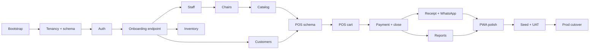

**Core state machines** (referenced by issues):

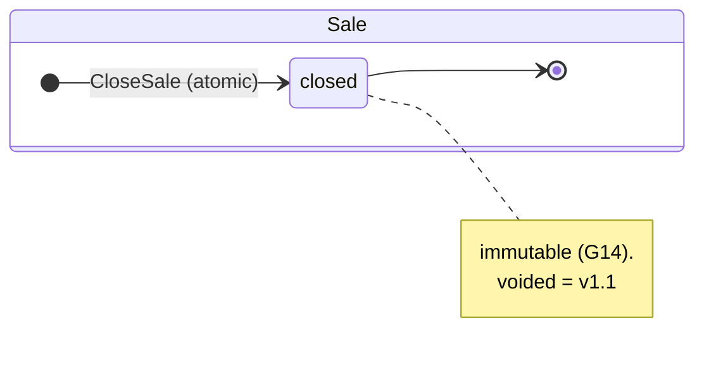

```mermaid
stateDiagram-v2
    direction LR
    state "Staff status" as U {
        [*] --> active
        active --> on_leave
        on_leave --> active
        active --> terminated
        on_leave --> terminated
        terminated --> [*]
        note right of terminated: terminal in MVP; blocks login
    }
```

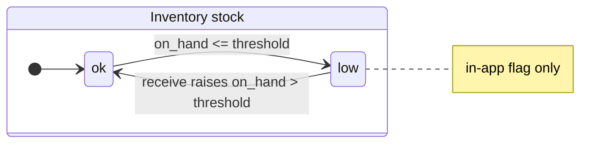

---

# FEATURE 0 — Project bootstrap

Infra only; mostly single mechanical PRs. Global rules apply once domain code lands.

### [I0.1] Copy `share` as base
- **Goal**: fresh checkout boots to welcome page.
- **PRs**: single. `rsync` (excl `.git`/`vendor`/`node_modules`/`.env`); `git init`; `.env.example` → `APP_NAME=Saloonify`; set app timezone `Asia/Dubai` (G10).
- **Acceptance**: [ ] `composer install`, `npm install`, `migrate:fresh` clean; [ ] `serve` renders welcome; [ ] `config('app.timezone')==='Asia/Dubai'`.
- **Depends**: — · **Labels**: `feature:bootstrap`, `area:infra`, `size:S`

### [I0.2] Scrub share-specific modules
- **PRs**: single. Delete `Documents`/`DocumentRequests`/`Sample` + routes + migrations. Keep `Businesses`/`Common`/`Logger`/`AuditLog`.
- **Acceptance**: [ ] no doc/sample routes; [ ] `migrate:fresh` clean; [ ] no broken imports.
- **Depends**: I0.1 · **Labels**: `feature:bootstrap`, `area:infra`, `size:S`

### [I0.3] WorkOS → Breeze-with-Livewire auth
- **PRs**: single. `composer remove laravel/workos`; strip `ValidateSessionWithWorkOS`; `breeze:install livewire`; rewrite `routes/auth.php`.
- **BR**: BR1. After this, all auth is cookie-session; no API tokens in MVP except the onboarding endpoint guard (see F3).
- **Acceptance**: [ ] `grep -ri workos` clean; [ ] login + logout work.
- **Depends**: I0.1 · **Labels**: `feature:bootstrap`, `area:auth`, `size:M`

### [I0.4] Dependency set + PHP 8.3 pin
- **PRs**: single. Add `moneyphp/money`, `barryvdh/laravel-dompdf`, `giggsey/libphonenumber-for-php`, dev tools (`telescope`, `pail`, `sail`, `ide-helper`), keep `simple-qrcode`; pin `php: ^8.3`; lockfiles.
- **Acceptance**: [ ] `composer install` + `npm run build` ok; [ ] `php -v` ≥ 8.3.
- **Depends**: I0.1 · **Labels**: `feature:bootstrap`, `area:infra`, `size:S`

### [I0.5] GitHub repo + CI
- **PRs**: single. `ci.yml` (Pint + Pest); branch protection on `main`.
- **Acceptance**: [ ] CI green; [ ] Pint clean; [ ] Pest runs.
- **Depends**: I0.1 · **Labels**: `feature:bootstrap`, `area:infra`, `size:S`

### [I0.6] Forge staging
- **PRs**: infra. me-central-1, EC2 t3.small + RDS MySQL 8; auto-deploy on `main`; staging `.env` (tz Asia/Dubai).
- **Acceptance**: [ ] staging serves; [ ] DB healthy; [ ] migration on deploy.
- **Depends**: I0.5 · **Labels**: `feature:bootstrap`, `area:infra`, `size:M`

### [I0.7] Sentry (backend + frontend)
- **PRs**: single. Verify config; staging DSN; `@sentry/browser`.
- **Acceptance**: [ ] server + browser errors both arrive.
- **Depends**: I0.6 · **Labels**: `feature:bootstrap`, `area:infra`, `size:S`

---

# FEATURE 1 — Tenancy + base schema

Security backbone. Heaviest testing burden.

### [I1.0] Schema: `audit_logs` + model
- **Goal**: audit table ready so every domain action (G11) can log.
- **PRs**: single. Verify/adapt `share` AuditLog migration to `data-model.md §audit_logs` + `AuditLog` model (`BelongsToBusiness`, JSON casts) + write/read test.
- **BR**: BR1. Audit rows are append-only — never updated or deleted by app code.
- **INV**: INV1. `before_json` null on create actions; `after_json` null on delete actions.
- **Acceptance**: [ ] migrates+rolls back; [ ] round-trips before/after JSON; [ ] append-only (no update/delete methods exposed).
- **Depends**: I0.2 · **Labels**: `feature:tenancy`, `area:tenancy`, `size:S`

### [I1.1] Schema: `businesses` + `Business` model
- **PRs**: single. Migration per `data-model.md §businesses` + model (JSON cast, slug auto-gen) + tests.
- **BR**: BR1. `slug` generated from name on create; immutable after. BR2. `trn`, `country`, `currency`, `tax_rate` are per-business config read by all calc (never hardcoded).
- **V**: V1. `trn` = exactly 15 numeric digits. V2. `currency` ISO-4217 (AED in MVP). V3. `tax_rate` 0–100, 2 dp.
- **INV**: INV1. `slug` globally unique; collision retries with numeric suffix.
- **E**: E1. Duplicate name → different slug, not an error. E2. Whitespace-only name → 422.
- **Acceptance**: [ ] migrates+rolls back; [ ] auto-slug + collision suffix; [ ] slug immutable on update.
- **Depends**: I0.2 · **Labels**: `feature:tenancy`, `area:tenancy`, `size:S`

### [I1.2] Schema: `locations` + `Location` model
- **PRs**: single. Migration per `data-model.md §locations` + model (rels, JSON casts) + tests.
- **BR**: BR1. A location belongs to exactly one business; deleting a business cascades its locations.
- **V**: V1. `address_json` shape = {street, city, emirate, country}. V2. `opening_hours_json` = 7 day entries, each {open, close} or closed flag; `open < close` when open.
- **INV**: INV1. `country` in a location mirrors its business country (locked).
- **E**: E1. Missing day in opening hours → 422. E2. `close <= open` → 422.
- **Acceptance**: [ ] migrates+rolls back; [ ] FK cascade; [ ] JSON round-trips; [ ] hours validation enforced.
- **Depends**: I1.1 · **Labels**: `feature:tenancy`, `area:tenancy`, `size:S`

### [I1.3] Schema: `users` ext + `UserRole` enum + model
- **PRs**: single. Migrations per `data-model.md §users` + `§location_user` (pivot) + `UserRole` enum + model rels/casts (incl. `User belongsToMany Location`) + tests.
- **State**: Staff-status machine (top of doc): `active`↔`on_leave`, →`terminated` (terminal).
- **BR**: BR1. `super_admin` has null `business_id`, no location memberships. BR2. `business_admin` has `business_id`, no membership rows (spans all). BR3. `location_agent` has `business_id` + ≥1 `location_user` row. BR4. `pin_hash` reserved, not gated in MVP. (Registry: BR-STAFF-04.)
- **V**: V1. `email` unique + always populated (synthetic allowed). V2. `username` unique when present. V3. `role` ∈ enum. V4. `status` ∈ enum. V5. pivot unique `(user_id, location_id)`.
- **INV**: INV1. role↔membership consistent with BR1–3 (DB-checkable in tests).
- **E**: E1. `location_agent` with zero memberships → invalid (caught in CreateStaff, F4).
- **Acceptance**: [ ] migrates+rolls back; [ ] unique email+username; [ ] pivot unique; [ ] `belongsToMany` resolves; [ ] casts resolve; [ ] illegal status transition rejected.
- **Depends**: I1.1, I1.2 · **Labels**: `feature:tenancy`, `area:auth`, `size:M`

### [I1.4] Tenant scoping: `BelongsToBusiness` + `BusinessScope`
- **PRs**: single. Trait + scope (reads `app('tenant.business_id')`, skips when unbound, auto-sets `business_id` on create) + scope tests against a fixture model.
- **BR**: BR1. Implements G1/G2. BR2. Create auto-fills `business_id` from bound tenant; explicit mismatching `business_id` on create → 409.
- **INV**: INV1. No query on a scoped model can return another business's rows when a tenant is bound.
- **E**: E1. Super-admin (unbound) write must set `business_id` explicitly or it's null — guard in callers.
- **Acceptance**: [ ] auto-scopes; [ ] unbound sees all; [ ] create auto-fills; [ ] cross-business fetch returns nothing (→404 in callers).
- **Depends**: I1.3 · **Labels**: `feature:tenancy`, `area:tenancy`, `size:M`

### [I1.5] Middleware: `TenantContext` + role gates
- **PRs**: single. `TenantContext` (bind tenant; 403 if non-super-admin lacks business) + `SuperAdmin`/`BusinessAdmin`/`LocationAgent` + aliases + tests.
- **BR**: BR1. Implements G3/G5. BR2. `location_agent` requests carry their **location membership set** (`location_user`) for downstream location guards.
- **E**: E1. Authenticated user with business but `terminated` → blocked earlier at login (G6); defense-in-depth check here too.
- **Acceptance**: [ ] tenant bound for business users, none for super-admin; [ ] role routes gate correctly (403); [ ] no-business non-super-admin → 403.
- **Depends**: I1.4 · **Labels**: `feature:tenancy`, `area:tenancy`, `size:M`

### [I1.6] Cross-cutting suite: tenancy + role isolation
- **PRs**: single. Tests: cross-business read → 404, super-admin sees all, business-admin scoped, location_agent limited to its assigned locations/own sales (multi-location membership), role-gate denials.
- **Acceptance**: [ ] ≥ 10 tests; [ ] covers `BusinessScope` + all three middlewares + G2/G3.
- **Depends**: I1.4, I1.5 · **Labels**: `feature:tenancy`, `area:tenancy`, `size:M`

---

# FEATURE 2 — Auth (email-or-username)

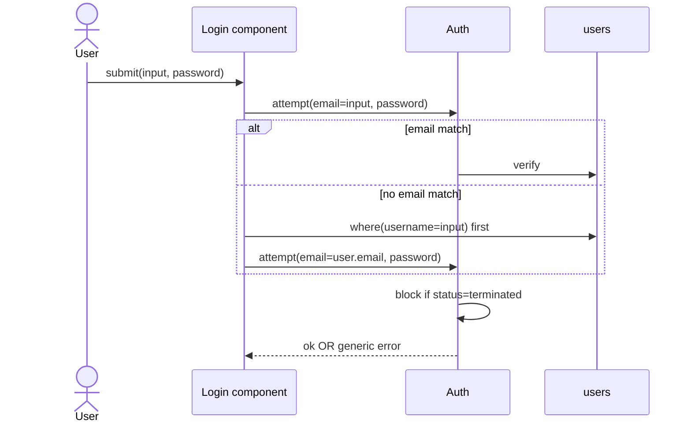

### [I2.1] Endpoint: email-or-username login
- **PRs**:
  - PR-1 backend: `SyntheticEmail` helper + resolver + tests.
  - PR-2 surface: `login.blade.php` single field + wiring.
- **BR**: BR1. Resolver tries email first, then username→email. BR2. `terminated` blocked (G6). BR3. Generic error on any failure (no user/credential enumeration). BR4. Synthetic email format `<username>@<business-slug>.saloonify.local`, lowercased + slugified.
- **V**: V1. Both fields required. V2. Rate-limit attempts (Laravel throttle) — lock after N tries.
- **E**: E1. Username exists but wrong password → generic error. E2. `on_leave` user **can** still log in (only `terminated` blocked). E3. Two businesses, same username → unique constraint prevents collision (usernames globally unique in MVP).
- **Acceptance**: [ ] email login; [ ] username login; [ ] synthetic-email login; [ ] terminated blocked; [ ] on_leave allowed; [ ] generic error; [ ] throttle works.
- **Depends**: I0.3, I1.3 · **Labels**: `feature:auth`, `area:auth`, `size:M`

### [I2.2] Endpoint: logout
- **PRs**: single. Nav button + POST `/logout` + test.
- **BR**: BR1. Logout invalidates session + regenerates token (CSRF/session fixation safety).
- **Acceptance**: [ ] redirects `/login`; [ ] session cleared; [ ] back-button after logout doesn't expose authed page.
- **Depends**: I0.3 · **Labels**: `feature:auth`, `area:auth`, `size:S`

---

# FEATURE 3 — Salon onboarding (ENDPOINT ONLY — no UI in MVP)

> SaaS owner stands up a salon via HTTP, not a screen. One call → business + first location + `business_admin` (with password), ready to log in. Add-location is a second endpoint, called by us on request. Self-serve admin UI is post-MVP. All endpoints behind `super_admin` auth.

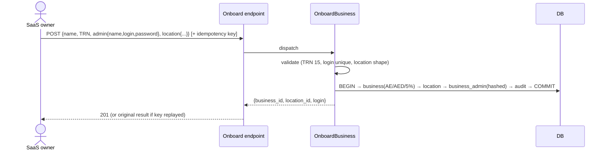

### [I3.1] Endpoint: onboard business (business + first location + admin)
- **Goal**: one authenticated `POST` stands up a usable salon.
- **PRs**:
  - PR-1 backend: `OnboardBusiness` UseCase — Request (name, TRN 15 digits, admin{name, login, password}, location{address, hours}; login unique) + Handler (single tx: business w/ defaults → first location → `business_admin` user, synthetic email if login is username-only → audit) + tests.
  - PR-2 surface: thin controller + `POST /api/admin/businesses` (super_admin guard) → JSON `{business_id, location_id, login}` + endpoint test. **No Volt page.**
- **BR**: BR1. Atomic — any failure rolls back all three creates (G17). BR2. Created admin is `active` and can authenticate immediately. BR3. Defaults `country=AE`, `currency=AED`, `tax_rate=5.00`. BR4. Idempotency key replay returns original (G18).
- **V**: V1. TRN 15 digits. V2. login unique (email or username form). V3. password meets policy (min length). V4. location passes I1.2 hours/address rules.
- **E**: E1. Duplicate TRN → allowed (TRN not unique across businesses unless business says so — confirm; default allow). E2. Duplicate login → 409. E3. Partial payload (no location) → 422. E4. Non-super-admin caller → 403.
- **Acceptance**: [ ] valid call creates all three in one tx; [ ] bad TRN → 422; [ ] dup login → 409; [ ] admin logs in after; [ ] non-super-admin → 403; [ ] replayed key → same result, no dup.
- **Depends**: I1.5, I1.6, I2.1 · **Labels**: `feature:onboarding`, `area:tenancy`, `size:M`

### [I3.2] Endpoint: add location to existing business
- **PRs**:
  - PR-1 backend: `AddLocation` UseCase (Request: target business + address + hours; Handler: scoped persist + audit) + tests.
  - PR-2 surface: thin controller + `POST /api/admin/businesses/{business}/locations` (super_admin) → JSON + test. **No Volt page.**
- **BR**: BR1. Location attaches to the named business only. BR2. Writes audit row.
- **V**: V1. address + hours rules (I1.2). V2. business must exist.
- **E**: E1. Unknown business → 404. E2. Non-super-admin → 403. E3. Duplicate location name within business → allowed (warn only).
- **Acceptance**: [ ] persists with JSON; [ ] unknown business → 404; [ ] non-super-admin → 403.
- **Depends**: I1.2 · **Labels**: `feature:onboarding`, `area:tenancy`, `size:S`

### [I3.3] Cross-cutting suite: onboarding happy path
- **PRs**: single. E2E: onboard via endpoint → admin logs in → add 2nd location; non-super-admin blocked throughout; idempotency replay.
- **Acceptance**: [ ] happy path green end to end.
- **Depends**: I3.1, I3.2 · **Labels**: `feature:onboarding`, `area:tenancy`, `size:S`

---

# FEATURE 4 — Staff management (UI, business_admin)

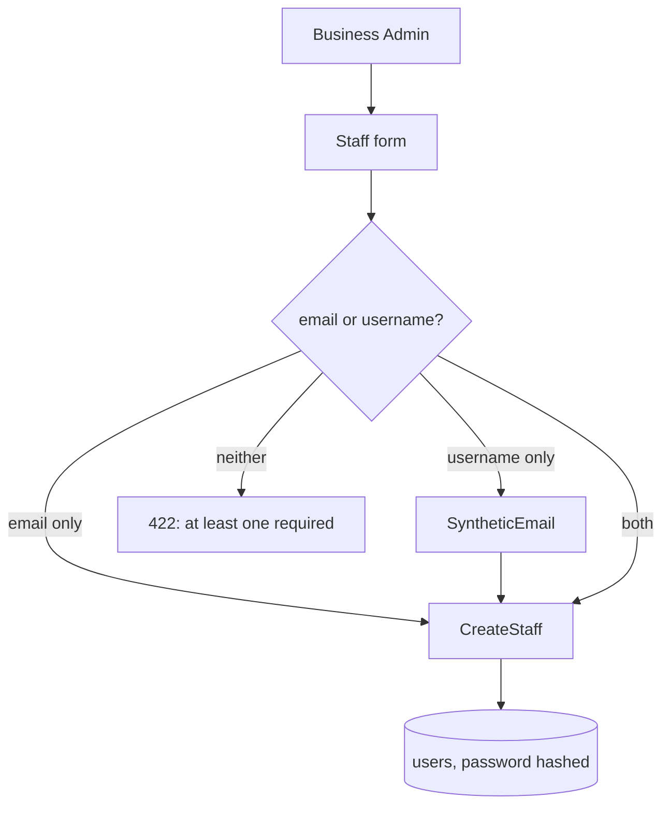

### [I4.1] Endpoint: create staff
- **PRs**:
  - PR-1 backend: `CreateStaff` UseCase (Request + Handler) + tests.
  - PR-2 surface: staff create Volt page + route + page test.
- **BR**: BR1. At least one of email/username. BR2. Username-only → synthetic email. BR3. Password hashed. BR4. `business_admin` can create `business_admin` or `location_agent` only (never `super_admin`). BR5. `location_agent` **must** be assigned ≥1 location (`location_user`), all of this business; `business_admin` gets no membership rows. BR6. New staff `status=active`. BR7. Audit row written. (Registry: BR-STAFF-04.)
- **V**: V1. role ∈ {business_admin, location_agent}. V2. every assigned location belongs to caller's business (G2 → else 404). V3. email valid + unique; username unique. V4. password policy. V5. location_agent location list non-empty.
- **E**: E1. Neither email nor username → 422. E2. `location_agent` with no locations → 422. E3. any location from another business → 404. E4. duplicate email/username → 409. E5. duplicate location in the list → dedup, not error.
- **Acceptance**: [ ] at-least-one enforced; [ ] synthetic email correct; [ ] login by email or username after; [ ] agent requires ≥1 own-business location; [ ] multi-location assign persists in pivot; [ ] cannot create super_admin.
- **Depends**: I2.1 · **Labels**: `feature:staff`, `area:auth`, `size:M`

### [I4.2] Endpoint: edit + deactivate staff
- **PRs**:
  - PR-1 backend: `UpdateStaff` UseCase + tests (incl. status-machine guards).
  - PR-2 surface: staff edit page + route + page test.
- **State**: staff-status machine. `active`↔`on_leave`; `active|on_leave`→`terminated`; `terminated` terminal.
- **BR**: BR1. `terminated` blocks login (G6). BR2. Cannot transition out of `terminated` (no reactivation in MVP). BR3. Cannot change a user's `business_id`. BR4. Cannot self-demote the last `business_admin` of a business (must always be ≥1 active admin). BR5. Role change to `location_agent` requires ≥1 location; can add/remove location memberships (`location_user`), but a `location_agent` must keep ≥1. BR6. Audit row written.
- **V**: V1. status transition legal (else 409). V2. role/location consistency (I4.1 V1–V2).
- **E**: E1. Reactivate terminated → 409. E2. Terminate the only active business_admin → 409. E3. Edit user from another business → 404.
- **Acceptance**: [ ] terminated cannot log in; [ ] terminated cannot be reactivated; [ ] last-admin guard holds; [ ] illegal transition → 409.
- **Depends**: I4.1 · **Labels**: `feature:staff`, `area:auth`, `size:M`

### [I4.3] Page: staff list
- **PRs**: single. Business-admin-scoped list (name, role, location, status, default chair) + route + page test.
- **BR**: BR1. Lists only caller's business staff (G1). BR2. Shows status badge + default chair (from F5).
- **Acceptance**: [ ] renders for business-admin; [ ] scoped; [ ] super-admin behaviour defined (empty unless impersonating).
- **Depends**: I1.3, I1.5 · **Labels**: `feature:staff`, `area:auth`, `size:S`

---

# FEATURE 5 — Chairs (UI, business_admin)

> Chair belongs to a location; optionally maps a default staff. Mapping is a default, not a lock (overridable at sale time, F10).

### [I5.1] Schema + endpoint: manage chairs
- **PRs**:
  - PR-1 backend: `chairs` migration per `data-model.md §chairs` + `Chair` model (`BelongsToBusiness`, rels) + `CreateChair`/`UpdateChair` UseCases + tests.
  - PR-2 surface: chairs index + form (per location) + routes + page test.
- **State**: chair `is_active` true↔false.
- **BR**: BR1. Chair's location must belong to caller's business. BR2. A staff is the default of **at most one** chair (`default_staff_user_id` unique). BR3. Default staff must belong to the chair's business (and ideally its location). BR4. Deactivating a chair keeps history but blocks new sale-line assignment (F10). BR5. Chair name unique within a location. BR6. Audit row written.
- **V**: V1. name non-empty, unique per location. V2. default_staff (if set) is active, same business, and a member of this chair's location (`location_user`). V3. location belongs to business. (Registry: BR-CHAIR-03.)
- **INV**: INV1. No two active chairs share the same `default_staff_user_id`.
- **E**: E1. Map a staff already default elsewhere → 409. E2. Map a terminated staff → 422. E3. Chair in another business/location → 404. E4. Duplicate name in location → 409.
- **Acceptance**: [ ] create/edit/deactivate; [ ] one-default-chair-per-staff enforced; [ ] inactive chair not assignable later; [ ] scope isolation.
- **Depends**: I1.2, I4.1 · **Labels**: `feature:chairs`, `area:catalog`, `size:M`

---

# FEATURE 6 — Customers

### [I6.1] Schema + endpoint: find-or-create customer
- **PRs**: PR-1 backend: `customers` migration per `data-model.md §customers` + `Customer` model (libphonenumber cast) + `FindOrCreateCustomer` UseCase + tests. (Surface = POS modal, I10.2.)
- **BR**: BR1. Identified by mobile; business-scoped (same mobile in 2 businesses = 2 rows). BR2. Name optional. BR3. No cross-business linking.
- **V**: V1. mobile parses to valid E.164 (UAE default region). V2. stored normalized E.164.
- **E**: E1. Invalid mobile → 422. E2. Existing mobile → return existing (no dup, no error). E3. Different format same number (050… vs +9715…) → normalize to one row.
- **Acceptance**: [ ] E.164 storage; [ ] cross-business isolation; [ ] find-or-create idempotent on normalized number.
- **Depends**: I1.4 · **Labels**: `feature:customers`, `area:catalog`, `size:S`

---

# FEATURE 7 — Catalog (services + combos)

### [I7.1] Schema + Money cast foundation
- **PRs**: single. Migrations per `data-model.md §services / §combos / §combo_services / §staff_service_commissions` + `MoneyFils` cast + `Service`/`Combo` models + model/cast tests.
- **BR**: BR1. `price` integer (G7). BR2. Combo has its **own** price (not sum). BR3. `translations` JSON, `name` (EN) primary.
- **V**: V1. fils ≥ 0. V2. commission 0–100.
- **INV**: INV1. AED↔fils conversion is exact and reversible (×100 / ÷100, integer).
- **Acceptance**: [ ] all migrate; [ ] `$service->price` Money in AED; [ ] fils integrity.
- **Depends**: I1.4 · **Labels**: `feature:catalog`, `area:catalog`, `size:M`

### [I7.2] Endpoint: create/edit service
- **PRs**: PR-1 backend `CreateService`/`UpdateService` + tests; PR-2 surface services index+form + page test.
- **BR**: BR1. Service belongs to caller's business. BR2. Editing price affects only future sales (past lines snapshot their own price). BR3. Soft constraints: deleting a service used by combos → block or detach (define: block with 409). BR4. Audit row.
- **V**: V1. name non-empty. V2. price ≥ 0. V3. commission 0–100. V4. duration ≥ 0 if set.
- **E**: E1. Negative price → 422. E2. Delete service in a combo → 409. E3. Service from other business → 404.
- **Acceptance**: [ ] CRUD works; [ ] fils integrity on edit; [ ] delete guarded; [ ] scope isolation.
- **Depends**: I7.1 · **Labels**: `feature:catalog`, `area:catalog`, `size:M`

### [I7.3] Endpoint: create/edit combo
- **PRs**: PR-1 backend `CreateCombo`/`UpdateCombo` + tests; PR-2 surface combos index+form (multi-select + reorder) + page test.
- **BR**: BR1. Combo references ≥1 service, all same business. BR2. Own price + flat `combo_commission_pct`. BR3. Optional `default_primary_stylist_user_id` (active, same business). BR4. Editing a combo never mutates past sales (snapshot at close, F11). BR5. Audit row.
- **V**: V1. ≥1 constituent service. V2. price ≥ 0. V3. commission 0–100. V4. display_order unique within combo.
- **E**: E1. Empty service list → 422. E2. Service from other business → 404. E3. default stylist terminated → 422.
- **Acceptance**: [ ] create with 3 services + reorder; [ ] scope isolation; [ ] past-sale immutability proven (edit combo, old sale unchanged).
- **Depends**: I7.2 · **Labels**: `feature:catalog`, `area:catalog`, `size:M`

---

# FEATURE 8 — Inventory (basic, manual)

> Coarse stock. No per-unit auto-deduction on sale (granular = v1.1).

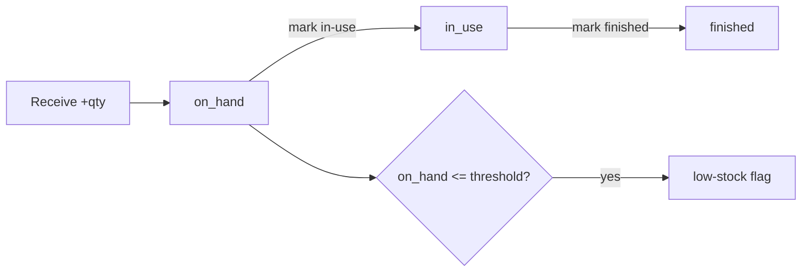

### [I8.1] Schema + endpoint: inventory items + stock actions
- **PRs**:
  - PR-1 backend: `inventory_items` migration per `data-model.md §inventory_items` + `InventoryItem` model + UseCases `CreateItem`, `UpdateItem`, `ReceiveStock`, `MarkInUse`, `MarkFinished` + tests.
  - PR-2 surface: inventory index + item form + quick stock-action buttons + page test.
- **State**: stock status `ok`↔`low` derived from `on_hand_qty ≤ reorder_threshold`.
- **BR**: BR1. Item belongs to a location of caller's business. BR2. `ReceiveStock(+q)` raises on_hand. BR3. `MarkInUse(q)` moves on_hand→in_use. BR4. `MarkFinished(q)` reduces in_use. BR5. No sale linkage (manual only). BR6. Low-stock is derived, surfaced in-app only (no email/SMS). BR7. Audit row per action.
- **V**: V1. name non-empty. V2. all quantities ≥ 0. V3. `reorder_threshold` ≥ 0.
- **INV**: INV1. `on_hand_qty ≥ 0` and `in_use_qty ≥ 0` always. INV2. cannot move more to in-use than on_hand. INV3. cannot finish more than in_use.
- **E**: E1. MarkInUse(q) with q > on_hand → 409. E2. MarkFinished(q) with q > in_use → 409. E3. negative qty in any action → 422. E4. item from other business/location → 404.
- **Acceptance**: [ ] CRUD + 3 stock actions; [ ] quantity invariants hold (INV1–3); [ ] low-stock flag flips at threshold; [ ] scope isolation; [ ] over-move/over-finish → 409.
- **Depends**: I1.2 · **Labels**: `feature:inventory`, `area:inventory`, `size:M`

---

# FEATURE 9 — POS schema

Schema + models only. Models bundled with their tables (no model-only PRs).

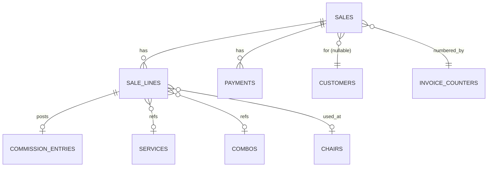

### [I9.1] Schema: counters + sales head
- **PRs**: single. Migrations per `data-model.md §invoice_counters / §sales` (note: unique `(business_id, invoice_series, invoice_number)`, composite index `(business_id, location_id, closed_at)`) + tests.
- **BR**: BR1. `status` enum = {`closed`} in MVP (`voided` reserved). BR2. `invoice_number` unique per `(business_id, invoice_series)`.
- **INV**: INV1. `next_value` monotonic non-decreasing (G16).
- **Acceptance**: [ ] both migrate; [ ] composite index present; [ ] invoice_number uniqueness constraint present.
- **Depends**: I6.1, I1.4 · **Labels**: `feature:pos-schema`, `area:pos`, `size:S`

### [I9.2] Schema: lines + payments + commission
- **PRs**: single. Migrations per `data-model.md §sale_lines / §payments / §commission_entries` (note: `sale_lines.chair_id` nullable FK; `commission_entries.reversal_of` self-FK) + tests.
- **BR**: BR1. `chair_id` records the chair used (auto-filled from stylist's default at cart time, F10). BR2. `combo_snapshot_json` freezes combo makeup at close (BR ref F7/F11).
- **Acceptance**: [ ] all migrate; [ ] `chair_id` nullable FK present.
- **Depends**: I9.1, I7.1, I5.1 · **Labels**: `feature:pos-schema`, `area:pos`, `size:S`

### [I9.3] Models: Sale, SaleLine, Payment, CommissionEntry
- **PRs**: single. Four models (rels, MoneyFils + enum casts) + model tests.
- **BR**: BR1. Sale model exposes **no** public mutators after close (enforces G14). BR2. SaleLine belongsTo Chair (nullable), Stylist (nullable), Service/Combo.
- **Acceptance**: [ ] relationships traversable; [ ] closed sale has no edit path.
- **Depends**: I9.2 · **Labels**: `feature:pos-schema`, `area:pos`, `size:M`

---

# FEATURE 10 — POS cart flow (UI)

Cart state client-side (Alpine); single submit at close (F11).

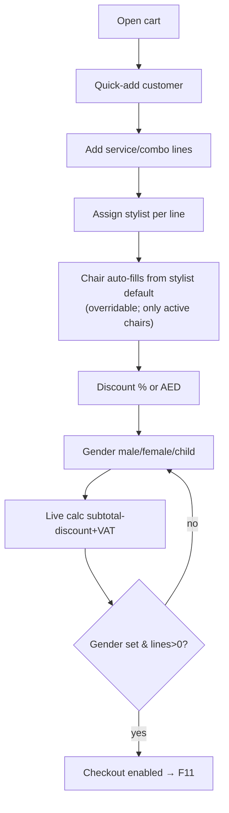

### [I10.1] Page: POS cart shell + mobile layout
- **PRs**: single. `cart.blade.php` + `layouts/mobile.blade.php` (bottom bar) + empty state + render test.
- **BR**: BR1. Checkout disabled while cart empty. BR2. Cart is client-side until close.
- **Acceptance**: [ ] renders 375px; [ ] empty state; [ ] checkout disabled when empty.
- **Depends**: I7.1 · **Labels**: `feature:pos-cart`, `area:pos`, `size:M`

### [I10.2] Component: customer quick-add modal
- **PRs**: single. Modal (libphonenumber autoformat) → `FindOrCreateCustomer` → attach + test.
- **BR**: BR1. Customer optional (walk-in may be anonymous). BR2. Attaches existing or creates (I6.1 rules).
- **E**: E1. Invalid mobile → inline error, no attach. E2. No customer → sale still closeable (receipt prompts for number later, F12).
- **Acceptance**: [ ] existing lookup; [ ] new created; [ ] anonymous sale allowed.
- **Depends**: I6.1, I10.1 · **Labels**: `feature:pos-cart`, `area:pos`, `size:M`

### [I10.3] Component: service/combo picker
- **PRs**: single. Searchable list (Alpine filter, Livewire fetch); tap adds line + test.
- **BR**: BR1. Only this business's active catalog shown. BR2. Adding a combo stores its current makeup to snapshot at close (not at add).
- **V**: V1. quantity ≥ 1 per line.
- **E**: E1. Empty search → full list. E2. Add same service twice → two lines or qty++ (define: qty++).
- **Acceptance**: [ ] search filters live; [ ] tap adds; [ ] dup add increments qty.
- **Depends**: I10.1 · **Labels**: `feature:pos-cart`, `area:pos`, `size:M`

### [I10.4] Component: stylist + chair + discount + gender
- **PRs**: single (related controls). Per-line stylist picker (active, location-scoped) → **chair auto-fills from stylist's default chair, overridable** (active chairs only); discount toggle (%/AED, bounds); gender 3-button (required) + tests.
- **BR**: BR1. Stylist must be active staff at this location. BR2. Chair auto = stylist's default chair if set + active; else blank, user may pick any active chair at this location. BR3. Inactive chair not selectable. BR4. Discount sale-level only. BR5. Gender required before checkout.
- **V**: V1. discount % ≤ 100; fixed ≤ subtotal; ≥ 0. V2. chair (if set) active + belongs to the sale's location. V3. stylist active + a member of the sale's location (`location_user`). (Registry: BR-SALE-07.)
- **E**: E1. Stylist with no default chair → chair blank (allowed). E2. Pick inactive chair → rejected. E3. Discount > subtotal (fixed) → clamp/422. E4. Change stylist → chair re-defaults (if user hadn't overridden) — define: re-default only if not manually set.
- **Acceptance**: [ ] chair auto-fills from stylist; [ ] override works; [ ] inactive chair blocked; [ ] discount bounds; [ ] checkout gated on gender.
- **Depends**: I10.3, I5.1 · **Labels**: `feature:pos-cart`, `area:pos`, `size:M`

### [I10.5] Live calc: subtotal / discount / VAT / total
- **PRs**: single (backend slice). `CartCalculator` (fils math, VAT from `business.tax_rate`, HALF_UP only here) + to-the-fils tests + wiring.
- **BR**: BR1. subtotal = Σ line_total. BR2. discount applied at sale level. BR3. VAT = round(net × tax_rate) HALF_UP. BR4. total = net + VAT.
- **INV**: INV1. total = subtotal − discount + tax, all integer fils, no drift.
- **E**: E1. 100% discount → net 0, VAT 0, total 0 (allowed). E2. Rounding boundary (e.g. .005) → HALF_UP.
- **Acceptance**: [ ] totals match hand calc to the fils; [ ] rounding HALF_UP at total only.
- **Depends**: I10.4 · **Labels**: `feature:pos-cart`, `area:pos`, `size:M`

---

# FEATURE 11 — Payment + close

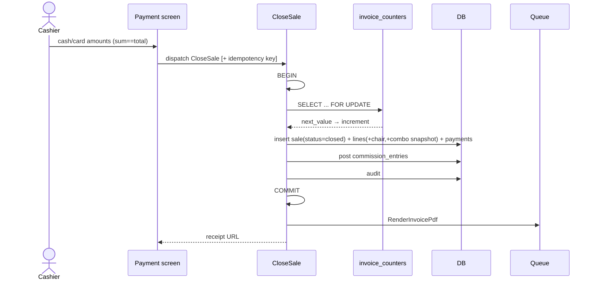

### [I11.1] Endpoint: close sale
- **PRs** (genuinely >500 → 3 PRs):
  - **PR-1 transaction core**: `CloseSale` UseCase — Request (cart lines + payments + gender + customer; totals reconcile) + Handler (`FOR UPDATE` counter → invoice number → insert sale(`closed`) + lines (with `chair_id` + `combo_snapshot_json`) + payments → audit → return Sale + receipt URL) + happy-path tests.
  - **PR-2 commission posting**: post `commission_entries` (per-service % of post-discount line basis; combo → flat % to default primary stylist) + commission tests (to-the-fils).
  - **PR-3 surface**: payment Volt page (cash/card inputs, live sum==total, Close CTA) + route + page test.
- **State**: creates Sale directly in `closed`; immutable thereafter (G14).
- **BR**: BR1. Single transaction; any failure rolls back everything (G17). BR2. Invoice number gapless + sequential per business (G16). BR3. `Σ payments == total`; methods cash/card only. BR4. Gender required. BR5. ≥1 line. BR6. Each line snapshots `unit_price` + (for combo) `combo_snapshot_json` — later catalog edits never change this sale. BR7. `chair_id` persisted per line. BR8. Commission posted once per line; combo commission to default primary stylist. BR9. Discount basis for commission = post-discount line (locked §10 default). BR10. Idempotency replay returns original sale (G18). BR11. Audit row.
- **V**: V1. payments sum == total (exact fils). V2. gender ∈ enum. V3. each line has valid service/combo of this business. V4. each stylist active + member of the sale's location; each chair active + belongs to the sale's location. V5. customer (if set) same business. V6. operator may operate the sale's location (business_admin = any; location_agent = a member). (Registry: BR-SALE-07.)
- **INV**: INV1. No gap/duplicate in invoice numbers under concurrency. INV2. Σ commission ≤ Σ line totals (sanity). INV3. closed sale never mutated afterward.
- **E**: E1. payments ≠ total → 409, no write. E2. empty cart → 422. E3. missing gender → 422. E4. concurrent close → both get distinct sequential numbers. E5. retry after timeout with same key → original sale, no dup. E6. attempt to re-close / edit closed sale → 409. E7. stylist/chair deactivated between cart and close → 409 (re-validate at close).
- **Acceptance**: [ ] single tx rollback on any failure; [ ] gapless invoice; [ ] sum≠total blocked; [ ] commission amounts correct; [ ] chair persisted; [ ] combo snapshot frozen; [ ] idempotent; [ ] closed sale immutable.
- **Depends**: I9.3, I10.5 · **Labels**: `feature:pos-close`, `area:pos`, `size:L`

### [I11.2] Job: render invoice PDF
- **PRs**: single. `RenderInvoicePdf` (database queue) → storage → write `invoice_pdf_path` + test.
- **BR**: BR1. Idempotent per sale (re-run overwrites same path, no dup). BR2. Failure retried; sale already valid without PDF (PDF is async, non-blocking).
- **E**: E1. Job fails → retried; receipt screen shows "preparing" until path set.
- **Acceptance**: [ ] PDF appears post-close; [ ] path persisted; [ ] re-run idempotent.
- **Depends**: I11.1 · **Labels**: `feature:pos-close`, `area:pos`, `size:M`

### [I11.3] Cross-cutting suite: concurrent close stress
- **PRs**: single. 2 workers × 50 closes → 100 unique contiguous invoice numbers; no orphaned partial sales.
- **Acceptance**: [ ] no gaps/dupes under contention; [ ] no partial rows on forced mid-tx failure.
- **Depends**: I11.1 · **Labels**: `feature:pos-close`, `area:pos`, `size:M`

---

# FEATURE 12 — Receipt + WhatsApp (UI)

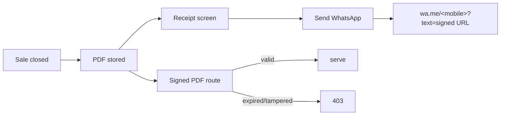

### [I12.1] Invoice PDF template (FTA)
- **PRs**: single. `invoices/pdf.blade.php` (business name + TRN + address, invoice no + date, line items w/ `name`/`translations['ar']`, subtotal/VAT/total AED) + render test.
- **BR**: BR1. Must carry FTA minimum fields + TRN. BR2. EN now; AR slot ready (renders if translation present). BR3. Amounts from stored fils, formatted to AED at render only.
- **Acceptance**: [ ] valid PDF; [ ] FTA fields present; [ ] amounts match sale to the fils.
- **Depends**: I11.2 · **Labels**: `feature:receipt`, `area:pos`, `size:M`

### [I12.2] Endpoint: receipt screen + signed PDF URL
- **PRs**: PR-1 backend `InvoicePdfController` + signed route `/invoices/{sale}/pdf` + test; PR-2 surface receipt page + WhatsApp deep-link handler + test.
- **BR**: BR1. PDF served only via signed, expiring URL. BR2. WhatsApp link uses customer mobile (minus `+`); prompts if no customer. BR3. Receipt readable only by users of the sale's business (G2).
- **V**: V1. signature valid + unexpired. V2. sale belongs to caller's business (web view).
- **E**: E1. Expired/tampered signature → 403. E2. No customer → prompt for number before opening WhatsApp. E3. PDF not ready yet → "preparing" state, poll.
- **Acceptance**: [ ] receipt renders post-close; [ ] signed URL serves + expires (403); [ ] WhatsApp opens iOS+Android prefilled; [ ] cross-business receipt → 404.
- **Depends**: I11.2 · **Labels**: `feature:receipt`, `area:pos`, `size:M`

---

# FEATURE 13 — Reports (UI, business_admin)

### [I13.1] Endpoint: sales report (sales + chair utilization)
- **PRs**: PR-1 backend `ComputeSalesReport` UseCase + to-the-fils tests; PR-2 surface report page (date range default today (Dubai tz), filters location/stylist/method) + page test.
- **BR**: BR1. Totals: gross/discount/VAT/net + per-method split + per-stylist commission. BR2. Chair utilization: sales/revenue grouped by `chair_id`. BR3. Default range = today in Asia/Dubai (G10). BR4. `location_agent` sees only its assigned locations + own sales (G3 / BR-TEN-03).
- **V**: V1. date range valid (start ≤ end). V2. filter IDs belong to business.
- **INV**: INV1. Report totals == raw SQL aggregate exactly (fils, no drift).
- **E**: E1. No sales in range → zeroed sections, not error. E2. Filter by other-business stylist/location → 404.
- **Acceptance**: [ ] totals match raw SQL; [ ] chair utilization correct; [ ] filters live; [ ] agent scoping; [ ] phone layout.
- **Depends**: I11.1 · **Labels**: `feature:reports`, `area:reports`, `size:M`

### [I13.2] Inventory report section
- **PRs**: single. Inventory on-hand per item + **low-stock list** (on_hand ≤ threshold) + test.
- **BR**: BR1. Scoped to caller's business/location. BR2. Low-stock derived live (no stored flag drift).
- **Acceptance**: [ ] on-hand listed; [ ] low-stock list correct at boundary; [ ] scope isolation.
- **Depends**: I8.1, I13.1 · **Labels**: `feature:reports`, `area:reports`, `size:S`

### [I13.3] CSV export
- **PRs**: single. `ExportSalesCsvController` (streams filtered line detail incl. stylist + chair) + route + test.
- **BR**: BR1. Same filters + scope as report. BR2. Streams (no full-set memory load).
- **E**: E1. 10k rows → streams without memory blowup. E2. Empty range → header-only CSV.
- **Acceptance**: [ ] correct rows incl chair; [ ] streams; [ ] scope honored.
- **Depends**: I13.1 · **Labels**: `feature:reports`, `area:reports`, `size:M`

---

# FEATURE 14 — PWA polish

### [I14.1] PWA installability
> Spec slots the stub in bootstrap; deferred here (depends only on I0.1; criteria easier once pages exist).
- **PRs**: single. `manifest.webmanifest` + icons (192/512) + `<link rel="manifest">` + `sw.js` (install-only cache; **no runtime cache** — online-only locked).
- **BR**: BR1. No offline data caching (online-only, §10.1-10).
- **Acceptance**: [ ] Lighthouse install pass; [ ] SW registered; [ ] static assets offline; [ ] no dynamic route cached.
- **Depends**: I0.1 · **Labels**: `feature:pwa`, `area:pwa`, `size:S`

### [I14.2] Add-to-home-screen prompt
- **PRs**: single. Alpine `beforeinstallprompt` (Android) + iOS tooltip.
- **Acceptance**: [ ] Android install completes.
- **Depends**: I14.1 · **Labels**: `feature:pwa`, `area:pwa`, `size:S`

### [I14.3] Disconnect banner + cart localStorage
- **PRs**: single. Alpine `online`/`offline` banner + cart serialize/rehydrate + disable close while offline + test.
- **BR**: BR1. Offline → block-and-banner; cart preserved; **close disabled** (§10.1-10). BR2. Reconnect re-enables close + re-validates (stylist/chair still active, I11.1 E7).
- **E**: E1. Reload offline → cart restored. E2. Close attempted offline → blocked.
- **Acceptance**: [ ] banner toggles; [ ] cart persists offline reload; [ ] close disabled offline.
- **Depends**: I10.5 · **Labels**: `feature:pwa`, `area:pwa`, `size:M`

### [I14.4] UX states pass
- **PRs**: split per area if >500. Loading skeletons, empty states, error toasts, tap targets ≥44×44px.
- **Acceptance**: [ ] manual audit all pages.
- **Depends**: I13.1 · **Labels**: `feature:pwa`, `area:ux`, `size:M`

---

# FEATURE 15 — Seed + UAT

### [I15.1] Demo seeder
- **PRs**: single. `DemoBusinessSeeder` (1 super-admin, 1 business+location via onboarding path, 1 business-admin, 3 agents incl. username-only, 4 chairs incl. defaults, 5 services, 2 combos, ~8 inventory items incl. one low) idempotent + test.
- **BR**: BR1. Idempotent (re-run no dup). BR2. Uses real UseCases (not raw inserts) so seed data obeys all rules.
- **Acceptance**: [ ] `db:seed` idempotent; [ ] seeded salon can immediately do a sale.
- **Depends**: I4.1, I5.1, I7.3, I8.1 · **Labels**: `feature:uat`, `area:infra`, `size:M`

### [I15.2] UAT script
- **PRs**: single (doc). `docs/UAT.md`: onboard (endpoint) → login → staff → chair → service → inventory → sale (with chair) → receipt → WhatsApp → report (sales+chair+inventory) → CSV.
- **Acceptance**: [ ] all steps green on staging.
- **Depends**: I14.4 · **Labels**: `feature:uat`, `area:ux`, `size:S`

### [I15.3] Pilot salon walkthrough
- **PRs**: none + issue log.
- **Acceptance**: [ ] 5 sales closed unassisted; [ ] issues logged.
- **Depends**: I15.2 · **Labels**: `feature:uat`, `area:ux`, `size:M`

---

# FEATURE 16 — Production cutover

### [I16.1] Provision prod
- **PRs**: infra + prod `.env` (tz Asia/Dubai). EC2 t3.medium me-central-1, RDS db.t3.small, HTTPS.
- **Acceptance**: [ ] prod serves HTTPS.
- **Depends**: I0.6 · **Labels**: `feature:prod`, `area:infra`, `size:M`

### [I16.2] First prod onboarding
- **PRs**: none (super-admin onboarding endpoint).
- **Acceptance**: [ ] first real sale closes in prod.
- **Depends**: I16.1, I15.3 · **Labels**: `feature:prod`, `area:infra`, `size:S`

### [I16.3] Monitoring sanity
- **PRs**: single. `/health` route + CloudWatch alarms (RDS CPU>80%, conns>50, storage<5GB) + confirm Sentry prod.
- **Acceptance**: [ ] test alarm fires + clears.
- **Depends**: I16.1 · **Labels**: `feature:prod`, `area:infra`, `size:S`

### [I16.4] v1.0 GA
- **PRs**: tag `v1.0.0` + release note.
- **Acceptance**: [ ] tag pushed; [ ] note published.
- **Depends**: I16.2, I16.3 · **Labels**: `feature:prod`, `area:infra`, `size:S`

---

## Summary

| Feature | Issues | PRs | New / notes |
| ------- | ------ | --- | ----------- |
| 0 Bootstrap | 7 | 7 | |
| 1 Tenancy + schema | 7 | 7 | I1.0 audit, I1.6 suite |
| 2 Auth | 2 | 3 | |
| 3 Onboarding (endpoint-only) | 3 | 5 | **no UI** |
| 4 Staff | 3 | 5 | last-admin guard, status machine |
| 5 Chairs | 1 | 2 | **NEW** |
| 6 Customers | 1 | 1 | |
| 7 Catalog | 3 | 5 | |
| 8 Inventory | 1 | 2 | **NEW** (basic/manual) |
| 9 POS schema | 3 | 3 | sale_lines.chair_id |
| 10 POS cart | 5 | 5 | chair auto-fill on line |
| 11 Payment + close | 3 | 5 | **I11.1 = 3 PRs (size:L)** |
| 12 Receipt | 2 | 3 | |
| 13 Reports | 3 | 4 | + chair util + inventory |
| 14 PWA | 4 | 4+ | |
| 15 Seed + UAT | 3 | 2 | |
| 16 Prod | 4 | 2 | |
| **Total** | **55 issues** | **~67 PRs** | only I11.1 needs 3 PRs |

**Discipline**: convert one feature to issues at a time; don't open the next feature until the current merges green. Every PR builds + passes its tests. Every BR/INV/V/E above should map to at least one automated test. If a PR creeps past ~500 lines, split along the backend/surface seam, both halves green.
